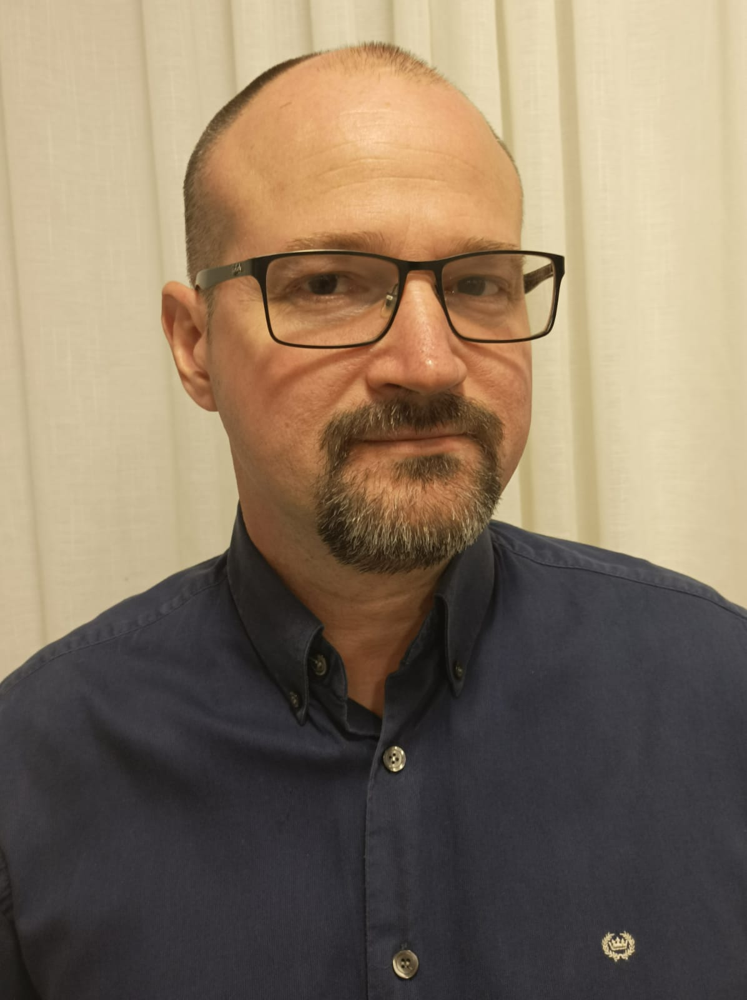

<a name="readme-top"></a>


<div align="center">

  
  <br/>

  <h3><b>ELDON RATZLAFF To Do List Web app</b></h3>

</div>

<!-- TABLE OF CONTENTS -->

# 📗 Table of Contents

- [📖 About the Project](#about-project)
  - [🛠 Built With](#built-with)
    - [Tech Stack](#tech-stack)
    - [Key Features](#key-features)
    - [🚀 Live Demo](#live-demo)
- [💻 Getting Started](#getting-started)
  - [Setup](#setup)
- [👥 Authors](#authors)
- [🔭 Future Features](#future-features)
- [🤝 Contributing](#contributing)
- [⭐️ Show your support](#support)
- [🙏 Acknowledgements](#acknowledgements)
- [📝 License](#license)

<!-- PROJECT DESCRIPTION -->

# 📖 ELDON RATZLAFF <a name="about-project"></a>

> PROYECTS AND SKILS FROM ELDON RATZLAFF


## 🛠 Built With <a name="built-with"></a>

### Tech Stack <a name="tech-stack"></a>

>  To Do List Web app Uses GitHub, HTML, CSS, js, Linters

<details>
  <summary>Client</summary>
  <ul>
    <li><a href="#">HTML</a></li>
    <li><a href="#">CSS</a></li>
    <li><a href="#">JS</a></li>
  </ul>
</details>

<!-- Features -->

### Key Features <a name="key-features"></a>


- **It shows you my projects**
- **It shows you my skills**

<p align="right">(<a href="#readme-top">back to top</a>)</p>


<!-- LIVE DEMO -->

## 🚀 Live Demo <a name="live-demo of my page"></a>
> loom presentation video
- [Loom presentation video]()

> Add a link to your deployed project.

- [Live Demo Link](https://eldonratzlaff.github.io/)

<p align="right">(<a href="#readme-top">back to top</a>)</p>


<!-- GETTING STARTED -->

## 💻 Getting Started <a name="getting-started"></a>

> Describe how a new developer could make use of your project.

To get a local copy up and running, follow these steps.

### Prerequisites

In order to run this project you need: Internet connection, a computer and running vscode.

<!--
Example command:

```sh
 gem install rails
```
 -->

### Setup

1.Clone this repository to your desired folder:https://github.com/Eldonratzlaff/capstone1

<!-- AUTHORS -->

## 👥 Authors <a name="authors"></a>


👤 ELDON RATZLAFF

- GitHub: [@githubhandle](https://github.com/githubhandle)
- Twitter: [@twitterhandle](https://twitter.com/twitterhandle)
- LinkedIn: [LinkedIn](https://linkedin.com/in/linkedinhandle)

<p align="right">(<a href="#readme-top">back to top</a>)</p>

<!-- FUTURE FEATURES -->

## 🔭 Future Features <a name="future-features"></a>

> Describe 1 - 3 features you will add to the project.

- [ ] **Adding more activities**
- [ ] **Remove activities**

<p align="right">(<a href="#readme-top">back to top</a>)</p>

<!-- CONTRIBUTING -->

## 🤝 Contributing <a name="contributing"></a>

Contributions, issues, and feature requests are welcome!

Feel free to check the [issues page](../../issues/).

<p align="right">(<a href="#readme-top">back to top</a>)</p>

<!-- SUPPORT -->

## ⭐️ Show your support <a name="support"></a>

> Write a message to encourage readers to support your project

If you like this project...

<p align="right">(<a href="#readme-top">back to top</a>)</p>

<!-- ACKNOWLEDGEMENTS -->

## 🙏 Acknowledgments <a name="acknowledgements"></a>

> My gratitude to Microverse for giving me the opportunity to improve my coding. Also shout outs to Nelson Araujo and Jakaria Jishan for working with me on the latest project.


<p align="right">(<a href="#readme-top">back to top</a>)</p>

<!-- LICENSE -->

## 📝 License <a name="license"></a>

This project is [MIT](MIT.md) licensed.

_

<p align="right">(<a href="#readme-top">back to top</a>)</p>
